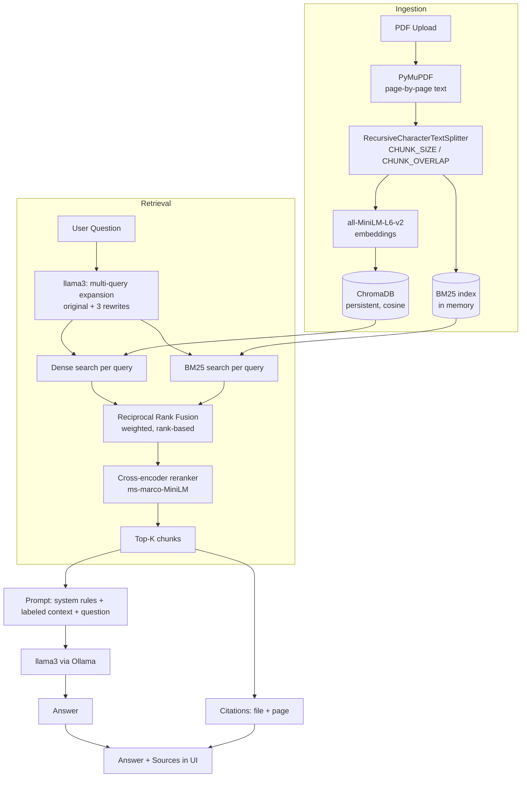

# College Notes AI — Chat with Your College Notes (RAG)

Upload your college PDF notes and ask questions about them in plain English.
Answers are generated **only** from your notes — never outside knowledge —
and every answer is cited with the exact PDF and page number it came from.

Everything runs locally: [Ollama](https://ollama.com) (llama3) for
generation, sentence-transformers for embeddings and reranking, ChromaDB on
disk, BM25 in memory. No API keys, no hosted services, no data leaving your
machine.

## 1. What makes this more than a toy RAG

A naive RAG app embeds the question, grabs the 5 nearest chunks, and hopes.
That fails in predictable ways, and this project fixes each one:

| Failure | Fix |
|---|---|
| The student's wording doesn't match the textbook's wording | **Multi-query expansion** — llama3 rewrites the question 3 ways, so retrieval gets several shots at the notes' actual vocabulary |
| Exact terms (`RAID 5`, `TCP`, `O(log n)`) rank below vaguely-related prose, because embeddings under-weight literal tokens | **Hybrid search** — BM25 keyword search runs alongside dense vector search, covering each other's blind spots |
| The two retrievers produce incomparable scores (cosine `[0,1]` vs unbounded BM25), so results can't just be averaged | **Reciprocal Rank Fusion** — fuses *ranks* rather than scores, with weights, so chunks that several queries or both legs agree on rise to the top |
| Fusion picks the shortlist but never reads the question against a chunk | **Cross-encoder reranking** — a precision pass over the ~20 survivors that scores each (question, chunk) pair directly |

## 2. Features

- Upload PDFs (lecture notes, textbooks, slides) — validated, deduplicated
  by content hash, and indexed in the background with live status in the UI
  (`Queued → Indexing… → Ready`, or `Failed` with a reason).
- Ask questions in a chat interface; optionally scope a question to one
  specific document.
- Four-stage retrieval: multi-query → hybrid (dense + BM25) → RRF → rerank.
- Answers are grounded strictly in retrieved chunks — if nothing relevant
  is found, the app says so instead of guessing.
- Every answer cites its sources: PDF filename + page number, taken from
  chunk metadata, never fabricated.
- Every stage is a switch in `.env`, so you can measure what each one buys.
- A retrieval evaluation script reporting real Hit@1/3/5 and latency.

## 3. Architecture



## 4. Project structure

The backend is six files. Each one owns a whole stage of the pipeline
rather than a single function, so following a request end-to-end means
reading two files, not twelve.

```
backend/app/
    config.py     all settings, read once from .env
    ingest.py     PDF → pages → chunks → embeddings → ChromaDB, + document store
    rag.py        the RAG engine: embeddings, vector store, BM25, multi-query,
                  RRF, reranking, retrieve(), and grounded generation
    schemas.py    every Pydantic request/response model
    api.py        all HTTP routes (documents + chat)
    main.py       FastAPI app, CORS, logging, error handling
backend/scripts/
    evaluate.py   Hit@1/3/5 + latency over eval_dataset.json
frontend/src/     React + Vite chat UI
```

## 5. The retrieval pipeline in detail

A question goes through `rag.retrieve()`:

1. **Multi-query expansion** — llama3 produces `MULTI_QUERY_COUNT`
   alternative phrasings. The rewrites are a retrieval aid only; the
   *original* question is what gets answered and what the reranker scores
   against. A parsing failure degrades to "original query only" rather
   than breaking the request.
2. **Hybrid search, per query** — each query (original + rewrites) runs
   two searches:
   - *Dense*: ChromaDB cosine nearest-neighbours, filtered by
     `RETRIEVAL_THRESHOLD`, because vector search always returns its `k`
     nearest neighbours even when none are actually relevant.
   - *Sparse*: BM25 over the same chunks. Never threshold-filtered — the
     point of the keyword leg is exact terms the embedding under-weights.
3. **Reciprocal Rank Fusion** — all those ranked lists (4 queries × 2 legs
   = 8) go into a *single* RRF pass. Each list votes for a chunk with
   `weight / (RRF_K + rank)`. Because only positions matter, cosine and
   BM25 scores never have to be made comparable, and a chunk ranked
   decently by many lists beats one ranked first by a single fluke.
4. **Cross-encoder reranking** — the top `CANDIDATES` survivors get scored
   by `ms-marco-MiniLM`, which reads the question and chunk *together*
   rather than comparing two independently-built vectors. Accurate but
   slow, which is why it only ever sees a shortlist.
5. **Generation** — the final `TOP_K` chunks are labeled
   `[Source: X.pdf | Page N]` and sent to llama3 with a system prompt that
   forbids outside knowledge. Citations are built from the chunks actually
   used.

## 6. Tech stack

**Backend:** Python, FastAPI, PyMuPDF, `langchain-text-splitters`,
Sentence-Transformers (bi-encoder + cross-encoder), ChromaDB, `rank-bm25`,
Ollama via the OpenAI Python SDK, Pydantic / pydantic-settings.

**Frontend:** React, Vite, Axios, plain CSS.

No agent framework: the RAG pipeline is written out explicitly so every
stage is visible and tunable.

## 7. Setup

### Ollama (required)

```bash
# 1. Install Ollama: https://ollama.com/download
# 2. Pull the model
ollama pull llama3
# 3. Ollama runs as a background service after install; if not:
ollama serve
```

### Backend

```bash
cd backend
python -m venv .venv
source .venv/bin/activate        # Windows: .venv\Scripts\activate
pip install -r requirements.txt
cp .env.example .env             # every value is already the default
uvicorn app.main:app --reload --port 8000
```

API docs: http://localhost:8000/docs

The embedding and reranker models download automatically on first use
(~120 MB total).

### Frontend

```bash
cd frontend
npm install
npm run dev
```

App: http://localhost:5173

## 8. Configuration (`backend/.env`)

| Variable | Default | Notes |
|---|---|---|
| `FRONTEND_ORIGIN` | `http://localhost:5173` | CORS |
| `CHUNK_SIZE` / `CHUNK_OVERLAP` | `700` / `100` | characters |
| `EMBEDDING_MODEL` | `sentence-transformers/all-MiniLM-L6-v2` | any Sentence-Transformers model |
| `TOP_K` | `5` | chunks sent to the LLM |
| `RETRIEVAL_THRESHOLD` | `0.3` | min cosine similarity on the dense leg |
| `CANDIDATES` | `20` | per-list candidates before fusion/reranking |
| `ENABLE_HYBRID` | `true` | add the BM25 leg |
| `VECTOR_WEIGHT` / `BM25_WEIGHT` | `0.7` / `0.3` | relative pull inside RRF |
| `ENABLE_MULTI_QUERY` | `true` | llama3 rewrites the question |
| `MULTI_QUERY_COUNT` | `3` | rewrites per question |
| `RRF_K` | `60` | the constant in `1/(k + rank)`; larger = gentler rank penalty |
| `ENABLE_RERANKER` | `true` | cross-encoder precision pass |
| `RERANKER_MODEL` | `cross-encoder/ms-marco-MiniLM-L-6-v2` | |
| `LLM_MODEL` | `llama3` | must match what you pulled with `ollama pull` |
| `LLM_BASE_URL` | `http://localhost:11434/v1` | Ollama's OpenAI-compatible endpoint |

**Speed vs quality:** multi-query costs one extra llama3 call per question
and reranking costs a model pass over ~20 chunks. On a slow CPU, set
`ENABLE_MULTI_QUERY=false` first — it's the most expensive stage. Set both
to `false` and you're back to plain dense retrieval, which is a useful
baseline to compare against.

## 9. API endpoints

| Method | Path | Description |
|---|---|---|
| GET | `/api/health` | Health check |
| GET | `/api/documents` | List uploaded documents (with status) |
| POST | `/api/documents/upload` | Upload a PDF; indexes in the background |
| DELETE | `/api/documents/{document_id}` | Delete a document and its vectors |
| POST | `/api/chat` | Ask a question; returns `{answer, sources}` |
| POST | `/api/chat/debug-retrieve` | Retrieval only, no LLM — see which chunks matched and why |

`debug-retrieve` is the fastest way to tune the pipeline: change a weight,
re-ask, and watch the ranking move without waiting on generation.

## 10. Evaluation

```bash
cd backend
source .venv/bin/activate
python scripts/evaluate.py
```

Reports **Hit@1 / Hit@3 / Hit@5** (did the expected source document appear
in the top-1/3/5 chunks?) and retrieval latency, computed live from
whatever is currently indexed. Edit `backend/scripts/eval_dataset.json` to
match the notes you actually uploaded.

**Reading the results:** high Hit@5 with low Hit@1 means retrieval finds
the right document but ranks it poorly — a reranking problem. Low Hit@5
means the right chunk never made the shortlist — a recall problem, so try
raising `CANDIDATES`, lowering `RETRIEVAL_THRESHOLD`, or leaning harder on
BM25. Toggling one stage off at a time in `.env` and re-running shows what
each stage is actually contributing on *your* notes.

## 11. Example questions

```
What is demand paging?
Explain the difference between TCP and UDP.
What is normalization?
What is the time complexity of B+ tree search?
Explain gradient descent.
```

## 12. Talking about this project in an interview

- **What problem does RAG solve?** LLMs can't know your private documents
  and can't cite sources from memory. RAG grounds generation in evidence
  retrieved at query time instead of retraining the model.
- **Why chunk?** One vector per input means a whole document's embedding
  averages many unrelated topics and matches nothing specific. Chunk size
  trades context completeness against topic purity.
- **Bi-encoder vs cross-encoder?** A bi-encoder embeds query and document
  independently, so document vectors are precomputed and search is cheap —
  good for recall over everything. A cross-encoder reads the pair jointly:
  more accurate, too slow to run over the corpus, so it reranks a
  shortlist. That two-stage funnel is recall first, precision second.
- **Why hybrid search?** Dense retrieval matches meaning but under-weights
  rare literal tokens; BM25 does the opposite. Queries containing both a
  concept and an exact term ("how does RAID 5 handle parity") need both.
- **Why RRF instead of averaging scores?** Cosine similarity and BM25 live
  on different, unbounded scales, so averaging them is meaningless without
  normalization that itself distorts results. RRF uses only rank position,
  which makes fusion scale-free — and it generalizes: here one RRF pass
  fuses across *both* query variations and retrieval legs at once.
- **Why multi-query?** One phrasing is one guess at how the source
  material words the idea. Several phrasings, fused, reduce the variance
  of that guess. The cost is one extra LLM call.
- **How do you prevent hallucination?** Nothing makes it impossible, but:
  threshold-filter weak chunks, instruct the model to answer only from
  context and to admit when it can't, and surface citations so ungrounded
  claims are visible rather than hidden.
- **How would you evaluate it?** Retrieval metrics (Hit@K, Recall@K, MRR)
  and generation metrics (groundedness, answer relevance) separately. This
  project measures the retrieval side directly; generation quality needs
  human review or LLM-as-judge.

## 13. Possible extensions

- **Streaming responses** — token-by-token instead of waiting for the full
  answer.
- **Conversation history** — each question is currently independent, so
  "explain that more" doesn't work yet. Needs history-aware query rewriting
  (fold the last turns into the expansion prompt).
- **Per-course collections** instead of one collection filtered by
  `document_id`.
- **Persisted BM25 index** — it's rebuilt in memory from ChromaDB on first
  use, which is instant at personal-notes scale but wouldn't be at millions
  of chunks.
- **Caching** repeated questions, **structured logging**, and a real
  database in place of the JSON document index once multiple users exist.

## 14. Troubleshooting

| Symptom | Likely cause | Fix |
|---|---|---|
| 502 with "Could not reach Ollama..." | Ollama isn't running | `ollama serve`, or open the Ollama app |
| Same error while Ollama runs | `LLM_MODEL` doesn't match a pulled model | `ollama list`, then `ollama pull llama3` |
| Every question is slow | Multi-query adds an LLM call; reranking adds a model pass | Set `ENABLE_MULTI_QUERY=false`, and `ENABLE_RERANKER=false` if still slow |
| First question after startup is very slow | Embedding/reranker models load lazily on first use | Expected; subsequent questions are fast |
| Answers ignore "say if you can't find it" | Small local models follow instructions less reliably | Use a larger model, or lower `temperature` in `app/rag.py` |
| Exact terms still don't match | BM25 leg off or outweighed | Check `ENABLE_HYBRID=true`, raise `BM25_WEIGHT` |

## Credits

Retrieval techniques (multi-query, RRF, hybrid search, reranking) follow
the patterns taught in
[harishneel1/rag-for-beginners](https://github.com/harishneel1/rag-for-beginners),
reimplemented here against a fully local stack (Ollama + sentence-transformers
+ rank-bm25) instead of OpenAI and Cohere.
