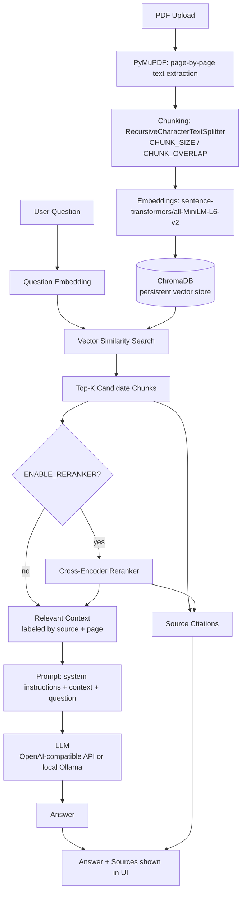

# College Notes AI — Chat with Your College Notes (RAG)

Upload your college PDF notes and ask questions about them in plain English.
Answers are generated **only** from your notes — never outside knowledge —
and every answer is cited with the exact PDF and page number it came from.

## 1. Project overview

This is a Retrieval-Augmented Generation (RAG) application built as both a
working tool and a learning project. It implements the full RAG pipeline
from scratch, with each piece intentionally small and readable rather than
hidden behind a framework:

PDF upload → text extraction → chunking → embeddings → vector storage →
semantic retrieval → (optional) reranking → prompt construction → LLM
generation → cited answer.

## 2. Features

- Upload PDFs (lecture notes, textbooks, slides) — validated and stored.
- Automatic background processing: text extraction, chunking, embedding,
  and indexing happen right after upload, with live status in the UI
  (`Queued → Indexing… → Ready`, or `Failed` with a reason).
- Ask questions in a chat interface; optionally scope a question to one
  specific document.
- Answers are grounded strictly in retrieved chunks — if nothing relevant
  is found, the app says so instead of guessing.
- Every answer shows its sources: PDF filename + page number, taken
  directly from chunk metadata (never fabricated).
- Duplicate-upload detection (by file content hash).
- Optional cross-encoder reranking stage (off by default).
- A retrieval evaluation script that measures real Hit@1/3/5 and latency.
- Configurable embedding model and local LLM (via Ollama) — chunk size,
  overlap, Top-K, and relevance threshold all live in `.env` too.

## 3. Architecture



## 4. The RAG pipeline in this project

1. **PDF parsing** (`services/pdf_loader.py`) — PyMuPDF extracts text
   page-by-page so every downstream chunk can be traced back to a page.
2. **Chunking** (`services/chunker.py`) — each page's text is split into
   ~700-character overlapping pieces along paragraph/sentence boundaries
   (`CHUNK_SIZE` / `CHUNK_OVERLAP`), tagged with `document_id`, `source`,
   `page`, `chunk_id`.
3. **Embeddings** (`services/embeddings.py`) — each chunk is turned into a
   384-dimensional vector with `sentence-transformers/all-MiniLM-L6-v2`.
4. **Vector database** (`services/vector_store.py`) — vectors, text, and
   metadata are stored in a local, persistent ChromaDB collection
   (cosine similarity space).
5. **Semantic retrieval** (`services/retriever.py`) — the question is
   embedded the same way, ChromaDB returns the nearest chunks, and any
   scoring below `RETRIEVAL_THRESHOLD` is dropped.
6. **Reranking** (`services/reranker.py`, optional) — a cross-encoder
   re-scores a wider candidate set for higher precision before the final
   Top-K is chosen. Disabled by default (`ENABLE_RERANKER=false`).
7. **Context construction & prompting** (`services/llm.py`) — retrieved
   chunks are labeled `[Source: X.pdf | Page N]` and assembled into the
   prompt alongside a system prompt that forces the model to answer only
   from that context.
8. **Generation** — a local LLM running through Ollama produces the
   answer from the prompt.
9. **Citations** (`api/chat.py`) — sources are built directly from the
   chunks actually used, deduplicated by (document, page), never invented.

## 5. Tech stack

**Backend:** Python, FastAPI, PyMuPDF, `langchain-text-splitters`,
Sentence-Transformers, ChromaDB, [Ollama](https://ollama.com) (local LLM,
called through the OpenAI Python SDK against its OpenAI-compatible
endpoint), Pydantic / pydantic-settings, python-dotenv.

**Frontend:** React, Vite, Axios, plain CSS.

## 6. Setup instructions

### Backend

```bash
cd backend
python -m venv .venv
source .venv/bin/activate        # Windows: .venv\Scripts\activate
pip install -r requirements.txt
cp .env.example .env
```

Edit `backend/.env` and make sure [Ollama](https://ollama.com) is
installed, running, and you've pulled the model named there:

```bash
ollama pull llama3      # or whichever model you set as LLM_MODEL
```

### Frontend

```bash
cd frontend
npm install
```

## 7. Environment variables (`backend/.env`)

| Variable | Default | Notes |
|---|---|---|
| `FRONTEND_ORIGIN` | `http://localhost:5173` | CORS |
| `CHUNK_SIZE` | `700` | characters per chunk |
| `CHUNK_OVERLAP` | `100` | characters shared between adjacent chunks |
| `EMBEDDING_MODEL` | `sentence-transformers/all-MiniLM-L6-v2` | any Sentence-Transformers model |
| `TOP_K` | `5` | chunks retrieved per question |
| `RETRIEVAL_THRESHOLD` | `0.3` | min cosine similarity to keep a chunk |
| `ENABLE_RERANKER` | `false` | turn on the cross-encoder reranking stage |
| `RERANKER_MODEL` | `cross-encoder/ms-marco-MiniLM-L-6-v2` | |
| `RERANK_CANDIDATES` | `20` | candidates fetched before reranking |
| `LLM_MODEL` | `llama3` | must match a model you've pulled with `ollama pull` |
| `LLM_BASE_URL` | `http://localhost:11434/v1` | Ollama's OpenAI-compatible endpoint |

**This project talks to a local LLM through [Ollama](https://ollama.com)**
— no API key, no hosted API, no data leaving your machine:

```bash
# 1. Install Ollama: https://ollama.com/download
# 2. Pull a model
ollama pull llama3
# 3. Ollama runs as a background service after install; if it's not
#    running, start it manually:
ollama serve
```

`LLM_MODEL` in `.env` must match whatever you pulled (`llama3`,
`mistral`, `phi3`, etc). If you want to use a hosted API instead later,
`app/services/llm.py` is the only file that needs to change — it already
uses the OpenAI Python SDK, which most hosted providers are compatible with.

## 8. Running the backend

```bash
cd backend
source .venv/bin/activate
uvicorn app.main:app --reload --port 8000
```

API docs: http://localhost:8000/docs

## 9. Running the frontend

```bash
cd frontend
npm run dev
```

App: http://localhost:5173

## 10. API endpoints

| Method | Path | Description |
|---|---|---|
| GET | `/api/health` | Health check |
| GET | `/api/documents` | List uploaded documents (with status) |
| POST | `/api/documents/upload` | Upload a PDF; auto-processes in the background |
| DELETE | `/api/documents/{document_id}` | Delete a document and its vectors |
| POST | `/api/chat` | Ask a question; returns `{answer, sources}` |
| POST | `/api/chat/debug-retrieve` | Retrieval only, no LLM call — for debugging/tuning |

## 11. How RAG works in this project (short version)

A plain LLM only knows what it memorized during training and can't cite
your specific notes. This app instead: embeds your question, searches a
vector database of your notes' chunks for the closest matches by meaning
(not just keywords), and hands only those matching chunks to the LLM with
an instruction to answer *only* from them. That's the "Retrieval-Augmented"
part — retrieval supplies the facts, generation supplies the explanation,
and citations trace every claim back to a real page.

## 12. Evaluation

```bash
cd backend
source .venv/bin/activate
python scripts/evaluate.py
```

This measures **Hit@1 / Hit@3 / Hit@5** (did the expected source document
appear in the top-1/3/5 retrieved chunks?) and retrieval latency, computed
live from whatever documents are currently indexed — nothing is
hard-coded. Edit `backend/scripts/eval_dataset.json` to match the notes
you've actually uploaded (the shipped file assumes `Operating Systems.pdf`,
`Computer Networks.pdf`, `DBMS.pdf`, `Machine Learning.pdf`).

**What Hit@K tells you:** if Hit@5 is high but Hit@1 is low, retrieval is
finding the right document but not ranking it first — try enabling the
reranker or lowering `TOP_K`. Retrieval latency isolates the vector-search
cost from LLM response time, since it's the part you can most directly
tune (embedding model size, candidate count, etc).

## 13. Example questions

```
What is demand paging?
Explain the difference between TCP and UDP.
What is normalization?
What is the time complexity of B+ tree search?
Explain gradient descent.
```

## 14. Future improvements (not implemented — opt-in)

- **Hybrid search** (BM25 keyword search + vector search combined) — helps
  with exact terms/acronyms embeddings can under-weight (e.g. "RAID 5").
- **Query rewriting** — expand a short/ambiguous question before retrieval.
- **Streaming LLM responses** — show the answer token-by-token instead of
  waiting for the full response.
- **Conversation history / follow-up questions** — currently each question
  is independent; multi-turn context would let you ask "explain that more".
- **Multiple subject collections** — separate ChromaDB collections per
  course instead of one shared collection filtered by `document_id`.
- **Metadata filtering by date/chapter**, **caching** repeated questions,
  **rate limiting**, structured **logging** to a file/observability tool,
  and swapping the JSON document index for a real database once multiple
  users are involved.

## 15. Explaining this project in an AI/ML interview

- **What problem does RAG solve?** LLMs can't know about private/recent
  documents and can't cite sources from memory. RAG grounds generation in
  retrieved evidence at query time instead of retraining the model.
- **Why chunk instead of embedding the whole document?** Embedding models
  produce one vector per input; a whole document's vector would average
  together many unrelated topics, matching poorly against any specific
  question. Small, coherent chunks each get their own precise vector.
  Trade-off: chunk size balances context completeness against topic purity.
- **Why cosine similarity?** It measures the angle between vectors
  (semantic direction), ignoring magnitude differences caused by text
  length — the standard metric for comparing sentence embeddings.
  Vectors are also normalized so search is consistent.
  Bi-encoder vs cross-encoder: a bi-encoder (used here for retrieval)
  embeds the query and each document independently, so document
  embeddings can be precomputed and search is cheap. A cross-encoder
  (used here for optional reranking) processes the (query, document) pair
  jointly and is more accurate but too slow to run over every document,
  so it's used as a two-stage funnel: bi-encoder for recall, cross-encoder
  for precision on a short candidate list.
- **How do you prevent hallucination in a RAG system?** No technique
  makes it impossible, but you reduce it by: sending only high-relevance
  chunks (threshold filtering), an explicit system prompt instruction to
  answer only from context and say when it can't, and requiring/verifying
  citations so ungrounded claims are visible rather than hidden.
- **How would you evaluate a RAG system?** Split into retrieval metrics
  (Hit@K / Recall@K / MRR — is the right source being found?) and
  generation metrics (groundedness/faithfulness — is the answer actually
  supported by the retrieved context — and answer relevance). This
  project measures the retrieval side directly (Phase 9's `evaluate.py`);
  generation quality typically needs human review or an LLM-as-judge setup.

## 16. Troubleshooting (Ollama)

| Symptom | Likely cause | Fix |
|---|---|---|
| Chat returns a 502 with "Could not reach Ollama..." | Ollama isn't running | Run `ollama serve`, or open the Ollama desktop app |
| Same error, but Ollama is running | `LLM_MODEL` in `.env` doesn't match a pulled model | `ollama list` to see installed models; `ollama pull <name>` to get one |
| Answers are slow | Local inference on CPU (or a large model) | Try a smaller model (`llama3:8b` is a good balance); a GPU speeds this up significantly |
| Answers ignore the "say if you can't find it" instruction | Smaller local models follow instructions less reliably than large hosted ones | Try a larger/instruction-tuned model, or lower `temperature` further in `app/services/llm.py` |
